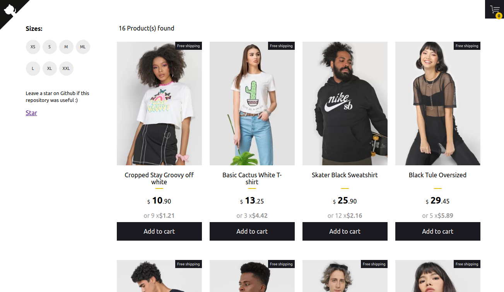

# 🛍️ React Shopping Cart 

<p align="center">
  
</p>

## 🚀 Live Demo
Check out the live demo: [react-shopping-cart-67954.firebaseapp.com](https://react-shopping-cart-67954.firebaseapp.com/)

## ✨ Features
- **Interactive Cart**: Add/remove products using Context API
- **Smart Filtering**: Filter products by available sizes
- **Modern Stack**: Built with React, TypeScript, and Styled Components
- **Responsive Design**: Works on all device sizes
- **Instant Updates**: Real-time UI feedback

## 🛠️ Technologies Used
- React with TypeScript
- React Hooks
- Context API
- Styled Components
- CI/CD with CircleCI

## 🏁 Getting Started

### Prerequisites
- Node.js (v14+ recommended)
- npm or yarn

### Installation
```bash
npm install
Running the App
bash
npm start
Running Tests
bash
npm run test
🖼️ Project Preview
<p align="center">  </p>
🤝 Contributing
Pull requests are welcome! For major changes, please open an issue first.

📜 License
MIT License - See LICENSE for details.

<p align="center">  <br> <sub>Created by <a href="http://www.jeffersonribeiro.com/">Jefferson Ribeiro</a></sub> </p><p align="center"> <sub>✈️ <a href="https://www.linkedin.com/in/jeremy-akeze-9542b396/">Follow Jeremy Akeze</a></sub> </p> ```
Key improvements:

Better Organization: Clear sections with emoji headers

Visual Hierarchy: Important elements stand out

Concise Information: Removed redundant text

Tech Stack Highlight: Added dedicated technologies section

Clean Formatting: Consistent markdown styling

Preserved All Key Elements: Kept all original links, badges, and credits

Mobile-Friendly: Good spacing and readability
